  # Team: Finding Alphas    
   

  #### <팩터와 시황분석을 적용한 포트폴리오 개발>
   

팀명              |  팀원
--------------  | -------------
퀀트 전략팀        | 손봉균, 최정택
퀀트 개발팀        | 박철준, 손해창
 ---
 #### 프로젝트 목표 
  데이터 분석을 통한 안전한 투자방법론 탐구
    
  1. 시황분석의 중요성 
    
  2. 투자자산 다양화의 중요성 
    
  3. 팩터투자의 중요성

---
#### 발표 순서
 

1. 시황분석
    
2. 투자 프레임워크 소개
    
3. 팩터투자 
    
---
#### 시황분석: 정의

      
    <미국경제를 디플레이션, 인플레이션, 회복기, 확장기로 분류>

      정의:
      - OECD 경기선행지수 100pt를 기준으로 고성장과 저성장으로 나눔
      - OECD 경기선행지수를 바탕으로 성장 상승 및 하락 추세 반영
      - Core PCE 물가지수 2.5%를 기준으로 고인플레이션과 저인플레이션으로 나눔

    - 국면:
      - deflation: 저성장/성장 하락 추세/저인플레이션
      - inflation: 저성장/성장 하락 추세/고인플레이션
      - recovery: 저성장/성장 상승 추세/저인플레이션, 저성장/성장 상승 추세/고인플레이션
      - expansion: 고성장/성장 상승 추세/고인플레이션, 고성장/성장 하락 추세/고인플레이션
----
#### 시황분석: SP500 지수 분석
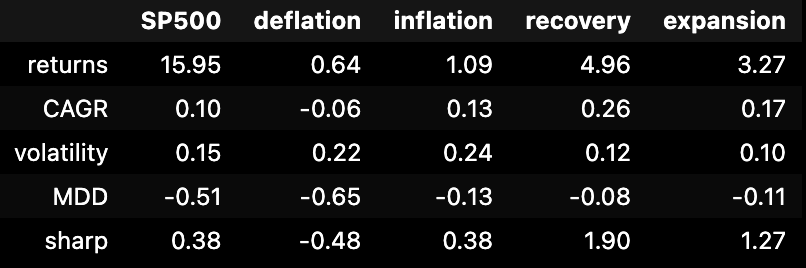
- 시황 적용의 필요성 인지
- recovery인 경우 가장 성과지표가 좋았다.
- 각 국면 별 투자성과가 좋은 자산군을 찾아보자.
----
#### 멀티에셋: 선정자산
  - 주식: sp500 index
   
  - 장기채권: TLT ETF
     
  - 원자재: GSG ETF(tracking S&P GSCI index)
     
  - 달러: UUP index
     
  - 부동산: VNQ ETF
---
#### 멀티에셋: Deflation 분석

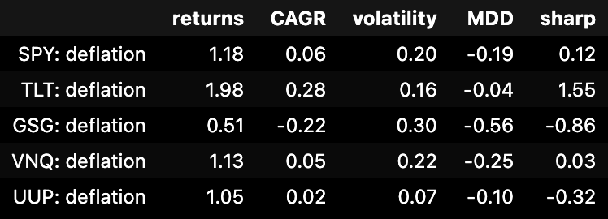

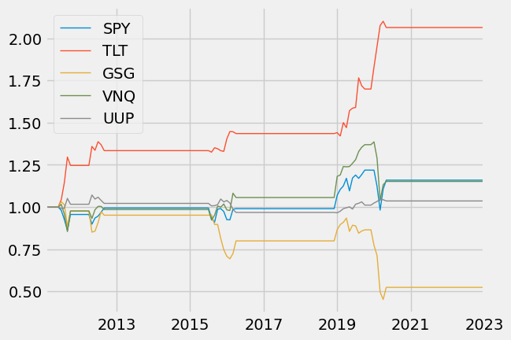

  - deflation: 저성장/성장 하락 추세/저인플레이션
  - 성장과 인플레이션이 모두 낮게 유지되는 국면
  - 위축 국면이 길어질수록 급격한 수요 감소와 디레버리징이 나타나게 되고 경기침체가 발생
  - 모든 위험 자산 가격이 크게 하락
  - 안전사잔인 장기채권과 달러가 가장 좋은 성과를 보임
---
#### 멀티에셋: Inflation 분석
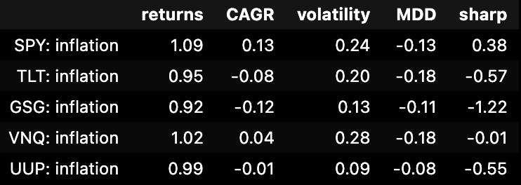
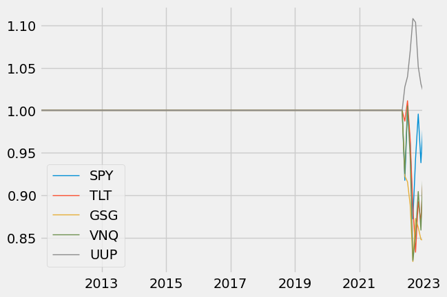
  - inflation: 저성장/성장 하락 추세/고인플레이션
  - 높은 인플레이션 유지되고 있지만 성장이 둔화 또는 침체되는 국면
  - 높은 인플레이션으로 인해 원자재 가격이 일시적으로 크게 상승할 수 있지만 경기 둔화로 인한 수요 감소 폭이 커질 경우 급격한 조정을 받는다.
  - 달러 인덱스만 수익 발생 -> 회복기에서 상승, 후퇴기에 하락, 위축기에 상승. 하지만 달러는 안전자산의 역할도 하기 때문에 경제 위축기에 상승하는 모습을 보이기도 한다.  

  --- 
  #### 멀티에셋: Recovery 분석
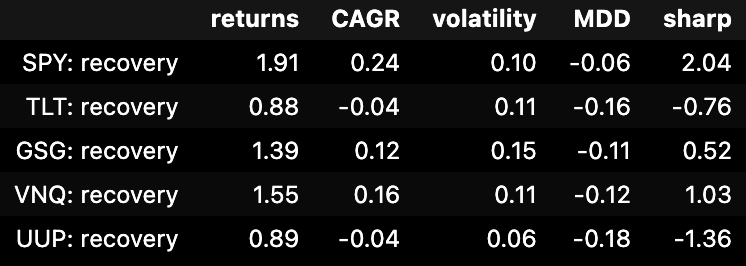
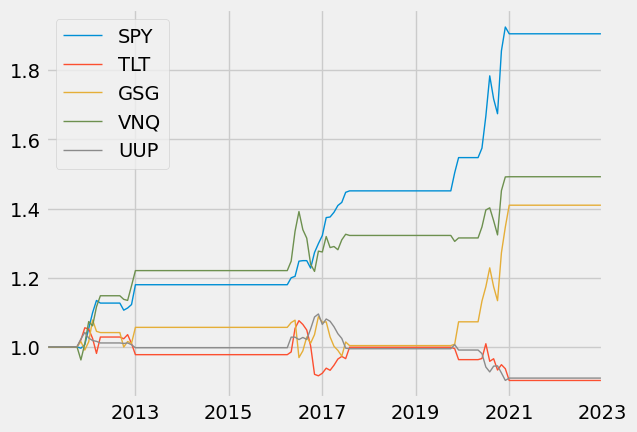
   - recovery: 저성장/성장 상승 추세/저인플레이션, 저성장/성장 상승 추세/고인플레이션
   - 경제가 회복하는 국면
   - 주식과 부동산 등 위험자산이 가장 좋은 성과를 보임
   - 경제와 인플레이션이 점차 회복되어 채권금리가 상승 -> 장기채권은 불리
   - 저성장 -> 원자재 역시 횡보하는 경향을 보임
   - 예외: 코로나 이후의 급등
  ---
  #### 멀티에셋: Expansion 분석
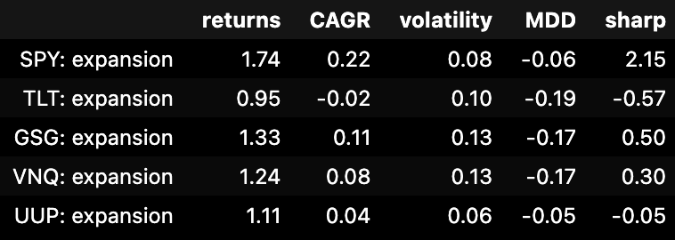
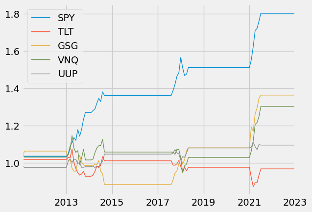
   - expansion: 고성장/성장 상승 추세/고인플레이션, 고성장/성장 하락 추세/고인플레이션
    - 경기가 피크를 찍는 국면
    - 연준은 과열을 막기 위해 긴축정책을 시행
    - 결국 경기는 점차 둔화되기 시작
    - 고성장으로 주식도 좋은 성과를 보임
    - 고성장 고인플레인션 국면 -> 원자재 주식 다음으로 좋은 성과 
---
### 종합
    - 회복국면
      - buy 주식, 부동산
      - sell 장기채권
    - 과열국면
      - buy 주식, 원자재
      - sell 장기 채권
    - 인플레이션
      - buy 달러
      - sell 주식
    - 위축국면
      - buy 장기채권
      - sell 주식, 부동산, 원자재
    
    - 추가 인사이트
      - 원자재는 거시경제의 영향과 수요와 공급(미시경제)의 영향 역시 많이 받는다. 
      -> 신문,기사 등의 영향을 추가하기 위해 NLP 사용해볼 수 있듯  ------
------
#### 투자성과 비교
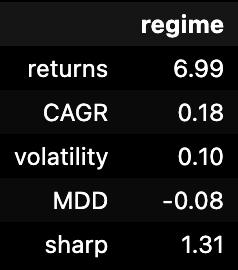
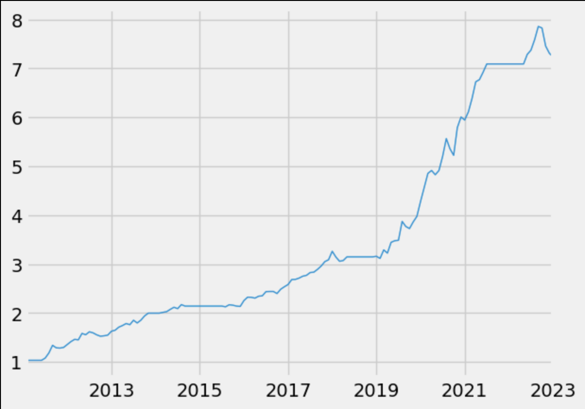
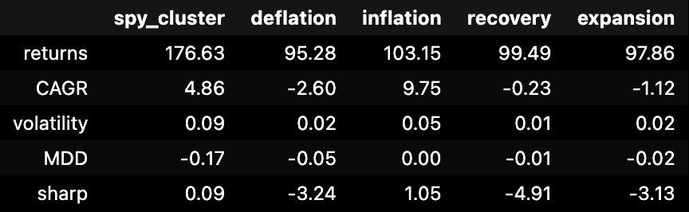

### 투자 프레임워크 소개
----
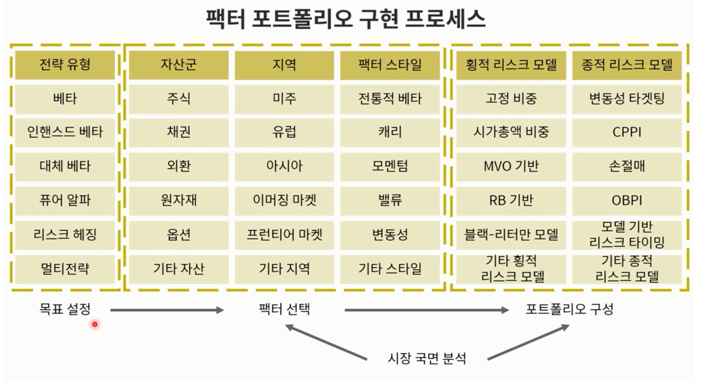
-----
### 목표 설정
- 목표 설정전략유형: 
  - 인헨스드 베타
  - 자산군: 주식

----
### 팩터 선택
  - 지역: 미주
  - 팩터 스타일
    - 듀얼모멘텀: 절대모멘텀 시그널 + 상대모멘텀 시그널
    - 베타: 고위험 시그널
    - 저변동성: 저변동성 시그널
    - AI forecasting: 시계열 예측에 따른 시그널
----
### 포트폴리오 구성
  - 횡적 리스크 모델: 위험자산간 투자비중 설정
    - 동일비중(Equal Weight)
    - 동일역변동성(Equally Modified Volatility)
    - 리스크페리티(Risk Parity)

  - 종적 리스크 모델: 위험자산과 무위험자산의 투자비중 설정
    - 고정비중